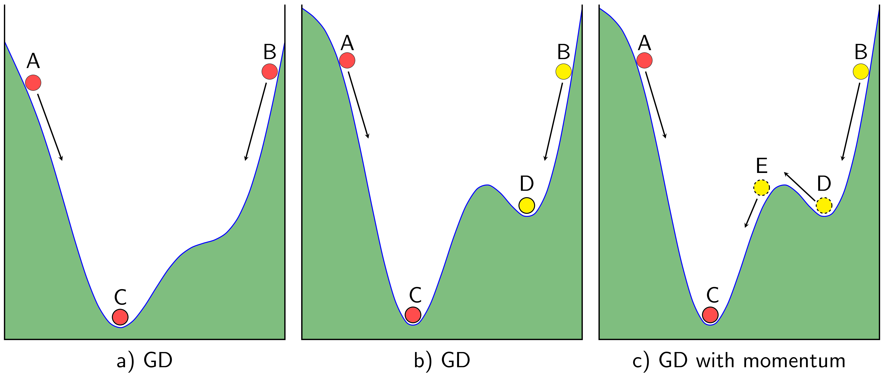
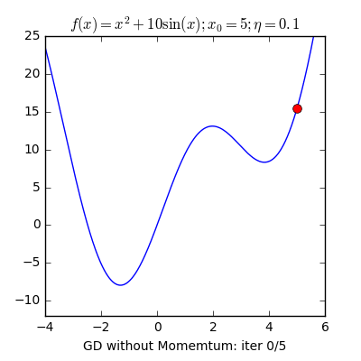

# Note Deep Learning

## 1. Tối ưu thuật toán Gradient Descent

### 1.1 Momentum




Việc sử dụng Gradient Descent (GD) sẽ gặp hạn chế khi hàm mà chúng ta xét có nhiều hơn 1 điểm local minimum, khi đó kết quả đã cho sẽ là hình b), thuật toán bị mắc kẹt tại cực tiểu D => chưa đúng kết quả mong muốn là điểm C. Việc sử dụng Momentum dưới góc độ vật lý có thể nói như lực đà giúp cho thuật toán có thể thoát khỏi cực tiểu D và tiếp tục tiến đến điểm C mong muốn.

Minh họa:




**Thay đổi so với GD:**

Cơ bản của thuật toán GD là update lại weights sau mỗi epoch theo công thức:

```Python
w = w - learning_rate*loss_grad
```

Khi sử dụng Momentum cho GD thì thay đổi như sau:

```Python
v_new = v_old*gama + learning_rate*loss_grad
w = w - v_new
```

Trong đó coi như `v` bắt đầu với `v_0 = 0` và `gama` có giá trị thường được chọn khoảng 0.9

### 1.2  Nesterov accelerated gradient (NAG)
### 1.3 Stochastic Gradient Descent (SGD)

Khác với thuật toán `GD` bình thường hay còn gọi là `Batch Gradient Descent` (batch ở đẫy có nghĩa là tất cả) , mỗi lần chạy epoch thì cập nhật `weights` dựa trên gradient của toàn bộ tập dữ liệu => 1 epoch - 1 lần cập nhật.

Giả sử có `N` điểm dữ liệu trong tập dữ liệu thì mỗi epoch, `SGD` sẽ cập nhật `weights` N lần, mỗi lần cập nhật thì `grad` được tính là `grad` của 1 điểm dữ liệu. Số lần chạy `SGD` sẽ nhỏ hơn số lần chạy `GD`, thường là 10 lần.

Ví dụ code `SGD` trên trang `machinelearningcoban.com`:

```Python
# single point gradient
def sgrad(w, i, rd_id):
    true_i = rd_id[i]
    xi = Xbar[true_i, :]
    yi = y[true_i]
    a = np.dot(xi, w) - yi
    return (xi*a).reshape(2, 1)

def SGD(w_init, grad, eta):
    w = [w_init]
    w_last_check = w_init
    iter_check_w = 10
    N = X.shape[0]
    count = 0
    for it in range(10):
        # shuffle data 
        rd_id = np.random.permutation(N)
        for i in range(N):
            count += 1 
            g = sgrad(w[-1], i, rd_id)
            w_new = w[-1] - eta*g
            w.append(w_new)

            # Kiểm tra điều kiện dừng thuật toán
            if count%iter_check_w == 0:
                w_this_check = w_new                 
                if np.linalg.norm(w_this_check - w_last_check)/len(w_init) < 1e-3:                                    
                    return w
                w_last_check = w_this_check
    return w
```

### 1.4 Điều kiện dừng thuật toán:

Trong thực nghiệm, có một vài phương pháp như dưới đây:

1. Giới hạn số vòng lặp, tức là số vòng lặp do mình tự đặt ra => không trực quan vì không biết được số lần lặp thế nào thì đủ cho nghiệm hội tụ.
2. So sánh gradient của nghiệm tại hai lần cập nhật liên tiếp, khi nào giá trị này đủ nhỏ thì dừng lại. Phương pháp này cũng có một nhược điểm lớn là việc tính đạo hàm đôi khi trở nên quá phức tạp (ví dụ như khi có quá nhiều dữ liệu), nếu áp dụng phương pháp này thì coi như ta không được lợi khi sử dụng SGD và mini-batch GD.
3. So sánh giá trị của hàm mất mát của nghiệm tại hai lần cập nhật liên tiếp, khi nào giá trị này đủ nhỏ thì dừng lại. Nhược điểm của phương pháp này là nếu tại một thời điểm, đồ thị hàm số có dạng bẳng phẳng tại một khu vực nhưng khu vực đó không chứa điểm local minimum (khu vực này thường được gọi là saddle points), thuật toán cũng dừng lại trước khi đạt giá trị mong muốn.
4. Trong SGD và mini-batch GD, cách thường dùng là so sánh nghiệm sau một vài lần cập nhật. Trong đoạn code Python phía trên về SGD có áp dụng việc so sánh này mỗi khi nghiệm được cập nhật 10 lần. Việc làm này cũng tỏ ra khá hiệu quả.


Ví dụ sử dụng `pytorch` và thực hiện from scratch bài toán với `Linear Regression` và `GD`, `SGD`:

[Ví dụ 1]()