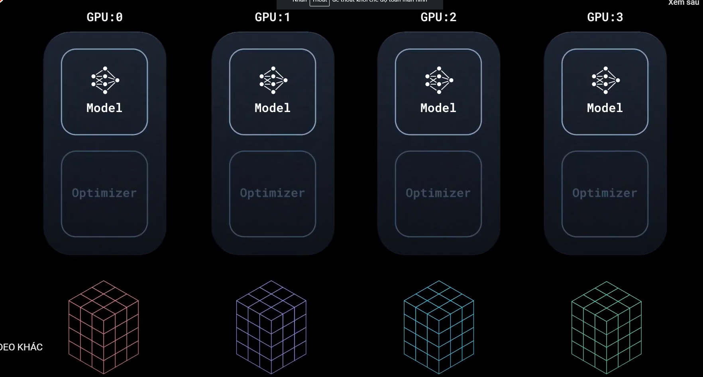
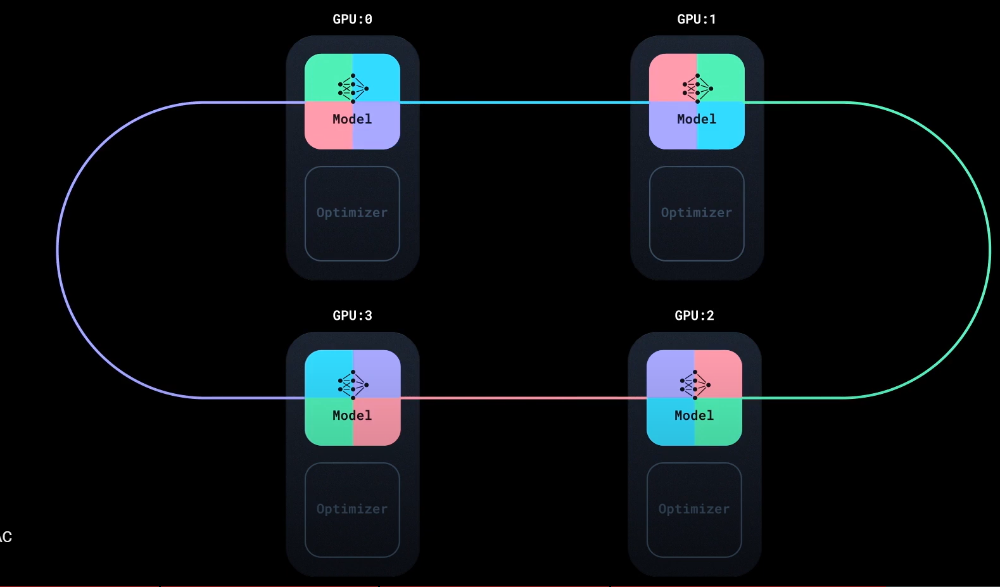
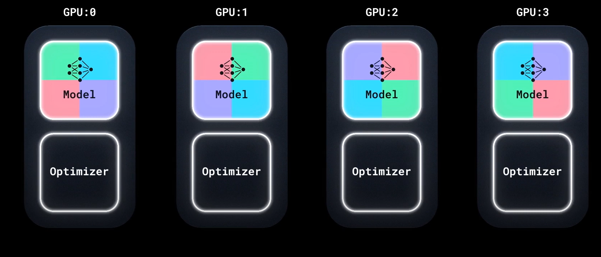

# Pytorch Distributed Training

Sử dụng `torch.DistributedDataParallel` (DDP) và `torch.distributed.launch`

## I. Architecture

Giả sử ta có 4 GPU, DDP sẽ thực hiện training song song trên cả 4 GPU này. Trong đó:

- Mỗi GPU sẽ có bản copy của local model (trạng thái ban đầu trước khi training trên các GPU), có cùng init parameters và optimizer
- Mỗi GPU sử dụng một tập data khác nhau

- Sau khi nhận được tín hiệu từ master, mỗi GPU gọi là các worker sẽ training trên các tập data khác nhau của chúng.



- Sau khi thực hiện tính toán được các gradients của mình, các worker sẽ đồng bộ hóa các gradients của chúng bằng cách tính trung bình các gradients này. Để như vậy thì chúng cần phải có được các gradient của nhau. Việc cập nhật trọng số của mô hình không đồng bộ sẽ dẫn đến việc huẩn luyện mô hình sẽ cho ra kết quả khác nhau => Sử dụng thuật toán [Ring all-reduce](https://viblo.asia/p/trai-nghiem-met-moi-khi-thu-training-mo-hinh-tren-nhieu-node-multi-node-training-Do754LAe5M6) để giải quyết vấn đề.



- Một khi gradients của các worker được đồng bộ, chúng sẽ tính toán ra gradient trung bình qua tập gradient của chúng và thực hiện bước optimizer step (cập nhật trọng số) => Các worker lại có cùng trọng số ban đầu để thực hiện quá trình training tiếp...



## II. Multi-GPU training with DDP

Xem ví dụ với app chạy single GPU [tại đây](./single_gpu.py)

Bây giờ ta sẽ viết lại app chạy multiple GPU với một số setting cho multiple GPU như sau:

### Thêm 3 thư viện

```Python
import torch.multiprocessing as mp
from torch.utils.data.distributed import DistributedSampler
from torch.nn.parallel import DistributedDataParallel as DDP
from torch.distributed import init_process_group, destroy_process_group
```

### Thêm function setup

```Python
def ddp_setup(rank, world_size):
    """
    Args:
        rank (): Unique identifier of each process
        world_size (int): Total number of process
    """
    os.environ["MASTER_ADDR"] = "localhost"
    os.environ["MASTER_PORT"] = "12355"
    init_process_group(backend="nccl", rank=rank, world_size=world_size)
```

Với:

Tham số truyền vào hàm:

- world_size : Số tiến trình thực hiện
- rank : một id, định danh nào độc nhất nào đó của mỗi process ( thường sẽ là index)

Ta sẽ setup máy chủ chính `MASTER_ADDR` là chính máy chủ hiện tại (localhost) và setup port chạy app trên máy chủ là `MASTER_PORT`.

Với hàm `init_process_group` của pytorch nhận vào các tham số:

- `backend = 'nccl'` : NVIDIA Collective Communications Library

### Bọc model lại bởi DDP

Trong class `Trainer`

```Python
def __init__(
    ...
) -> None:
    # every thing before stay the same
    ...
    self.model = DDP(model, device_ids=[gpu_id])
```

Do bây giờ model của ta được bọc bởi `DDP` cho nên khi lấy `state_dict()` trong hàm `_save_checkpoint` ta phải sửa như sau:

```Python
def _save_checkpoint(self, epoch):
    ckp = self.model.module.state_dict()
    PATH = "checkpoint.pth"
    torch.save(ckp, PATH)
    print(f"Epoch {epoch} | Training checkpoint saved at {PATH}")
```

Do sau quá trình sử dụng `all ring-reduce` và thực hiện cập nhật trọng số => tất cả các worker đều trở thành như nhau => Việc lưu lại trọng số chỉ cần thực hiện trên một trong các worker => ta sử lại hàm `train` để app chỉ lưu trọng số lại của `gpu_id = 0`

```Python
def train(self, max_epochs: int):
    for epoch in range(max_epochs):
        self._run_epoch(epoch)
        if self.gpu_id == 0 and epoch % self.save_every == 0:
            self._save_checkpoint(epoch)
```

### Sửa lại dataloader

```Python
def prepare_dataloader(dataset: Dataset, batch_size: int):
    return DataLoader(
        dataset,
        batch_size=batch_size,
        pin_memory=True,
        shuffle=False,
        sampler=DistributedSampler(dataset)
    )
```

### Sửa lại hàm main

```Python
def main(rank: int, world_size: int, save_every: int, total_epochs: int, batch_size: int):
    ddp_setup(rank=rank, world_size=world_size)
    dataset, model, optimizer = load_train_objs()
    
    train_data = prepare_dataloader(dataset, batch_size)
    trainer = Trainer(model, train_data, optimizer, rank, save_every)
    trainer.train(total_epochs)
    destroy_process_group()
```

```Python
if __name__ == "__main__":
    import argparse
    
    parser = argparse.ArgumentParser(description='simple distributed training job')
    parser.add_argument('total_epochs', type=int, help='Total epochs to train the model')
    parser.add_argument('save_every', type=int, help='How often to save a snapshot')
    parser.add_argument('--batch_size', default=32, help='Input batch size on each device (default: 32)')
    args = parser.parse_args()
    
    world_size = torch.cuda.device_count()
    mp.spawn(main, args=(world_size, args.save_every, args.total_epochs, args.batch_size), nprocs=world_size) 
```